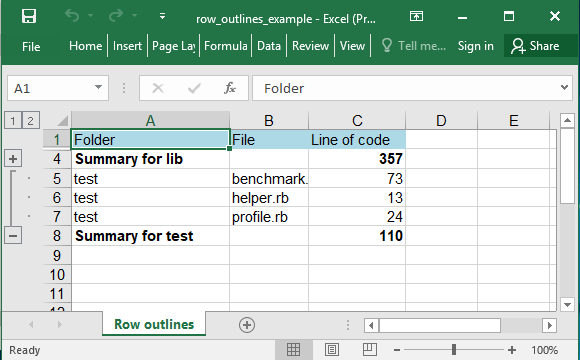
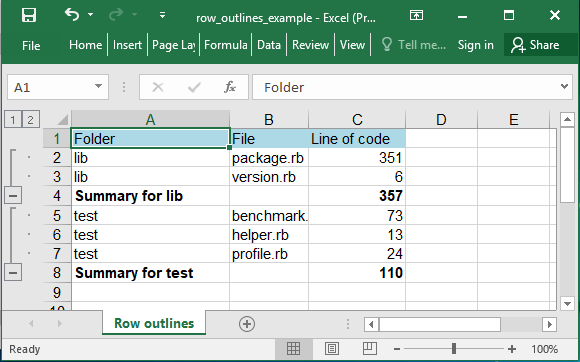
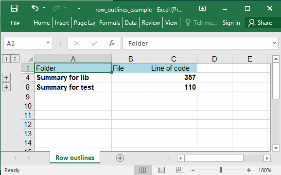

## Description

If you have a list of data that you want to group and summarize, you can create an outline of up to eight levels. Each inner level, represented by a higher number in the outline symbols, displays detail data for the preceding outer level, represented by a lower number in the outline symbols.

## Code

```ruby
require 'axlsx'

Axlsx.escape_formulas = false

p = Axlsx::Package.new
wb = p.workbook

s = wb.styles
header = s.add_style bg_color: 'ADD8E6'
summary = s.add_style b: true

wb.add_worksheet(name: 'Row outlines') do |sheet|
  # Header
  sheet.add_row ['Folder', 'File', 'Line of code'], style: header

  # First folder
  sheet.add_row ['lib', 'package.rb', 351]
  sheet.add_row ['lib', 'version.rb', 6]
  sheet.outline_level_rows 1, 2, 1, true # From line 1 to line 2, level 1, collapsed
  sheet.add_row ['Summary for lib', nil, '=sum(C2:C3)'], style: summary

  # Second folder
  sheet.add_row ['test', 'benchmark.rb', 73]
  sheet.add_row ['test', 'helper.rb', 13]
  sheet.add_row ['test', 'profile.rb', 24]
  sheet.outline_level_rows 4, 6, 1, false # From line 4 to line 6, level 1, open
  sheet.add_row ['Summary for test', nil, '=sum(C5:C7)'], style: summary
end

p.serialize 'row_outlines_example.xlsx'
```

## Output



After opening the outline:



Closing both outlines:


