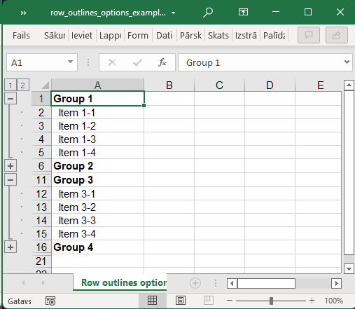

## Description

Outline summary rows can be positioned below (default) or above the details, corresponding to "Summary rows below detail" option in Excel.

Outline level can be set with helper methods (preferred), or on per-row basis.

## Code

```ruby
require 'axlsx'

p = Axlsx::Package.new
wb = p.workbook

s = wb.styles
summary = s.add_style b: true

wb.add_worksheet(name: 'Row outlines options') do |sheet|
  # This option specifies whether summary rows go above or below detail, worksheet-wide
  sheet.sheet_pr.outline_pr.summary_below = false

  # When specifying outline levels without helper methods, you must enable outline symbols manually.
  sheet.sheet_view.show_outline_symbols = true

  (1..4).map do |x|
    sub_group_hidden = x % 2 == 0

    x_row = sheet.add_row ["Group #{x}"], style: summary
    # Outline depth level can be set as property on the row
    x_row.outline_level = 0

    (1..4).map do |y|
      y_row = sheet.add_row ["  Item #{x}-#{y}"]
      y_row.outline_level = 1

      # Whether or not the outline level starts collapsed is governed by the `hidden` property on the row
      y_row.hidden = sub_group_hidden
    end
  end
end

p.serialize 'row_outlines_options_example.xlsx'
```

## Output


