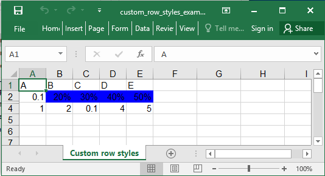

## Description

There is a way to add styles to a whole row.

## Code

```ruby
require 'axlsx'

p = Axlsx::Package.new
wb = p.workbook

s = wb.styles
percent = s.add_style num_fmt: 9, bg_color: '0000FF'

wb.add_worksheet(name: 'Custom row styles') do |sheet|
  sheet.add_row ['A', 'B', 'C', 'D', 'E']
  sheet.add_row [0.1, 0.2, 0.3, 0.4, 0.5]
  sheet.add_row ['H', 'I', 'D', 'E', '!']
  sheet.add_row [1, 2, 0.1, 4, 5.0]

  # Apply the percent style to the row at index 2 skipping the first column.
  sheet.row_style 1, percent, col_offset: 1
  sheet.rows[2].hidden = true
end

p.serialize 'row_styles_example.xlsx'
```

## Output


