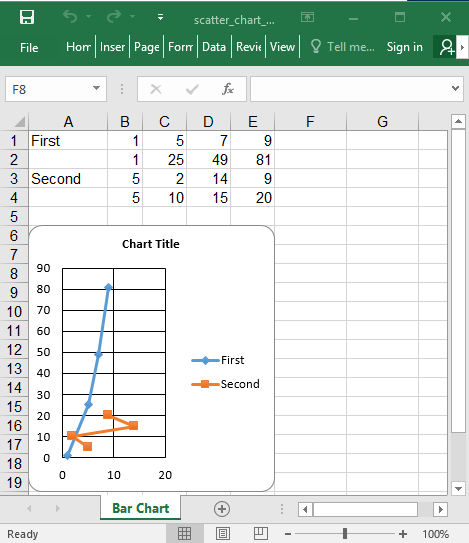

## Description

Scatter chart example

## Code

```ruby
require 'axlsx'

p = Axlsx::Package.new
wb = p.workbook

wb.add_worksheet(name: 'Bar Chart') do |sheet|
  sheet.add_row ['First',  1,  5,  7,  9]
  sheet.add_row ['',       1, 25, 49, 81]
  sheet.add_row ['Second', 5,  2, 14,  9]
  sheet.add_row ['',       5, 10, 15, 20]

  sheet.add_chart(Axlsx::ScatterChart, start_at: 'A6', end_at: 'F20') do |chart|
    chart.add_series xData: sheet['B1:E1'], yData: sheet['B2:E2'], title: sheet['A1']
    chart.add_series xData: sheet['B3:E3'], yData: sheet['B4:E4'], title: sheet['A3']
  end
end

p.serialize 'scatter_chart_example.xlsx'
```

## Output


