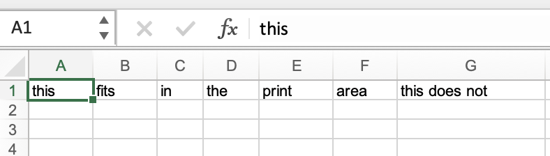
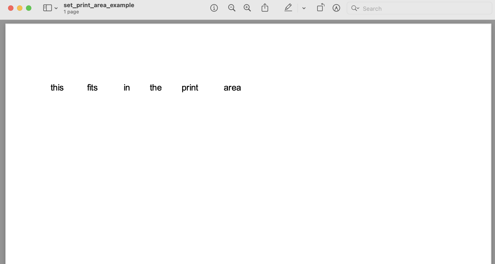

## Description

Change the range of cells that will be printed out when the sheet is printed

## Code

```ruby
require 'axlsx'

p = Axlsx::Package.new
wb = p.workbook

wb.add_worksheet(name: 'PrintArea') do |sheet|
  sheet.add_row ['this', 'fits', 'in', 'the', 'print', 'area', 'this does not']
  sheet.page_setup.fit_to width: 1, height: 1
  wb.add_defined_name("PrintArea!A1:F1", local_sheet_id: sheet.index, name: '_xlnm.Print_Area')
end

p.serialize 'set_print_area_example.xlsx'
```

## Output



