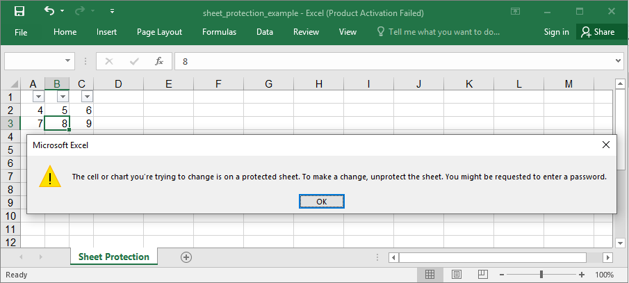

## Description

You could lock sheets and exclude some of the cells.

## Code

```ruby
require 'axlsx'

p = Axlsx::Package.new
wb = p.workbook

s = wb.styles
unlocked = s.add_style locked: false

wb.add_worksheet(name: 'Sheet Protection') do |sheet|
  sheet.sheet_protection do |protection|
    protection.password = 'fish'
    protection.auto_filter = false
  end

  sheet.add_row [1, 2 ,3], style: unlocked # These cells won't be locked
  sheet.add_row [4, 5, 6]
  sheet.add_row [7, 8, 9]

  # Set up auto filters
  sheet.auto_filter = 'A1:C3'
end

p.serialize 'sheet_protection_example.xlsx'
```

## Output


