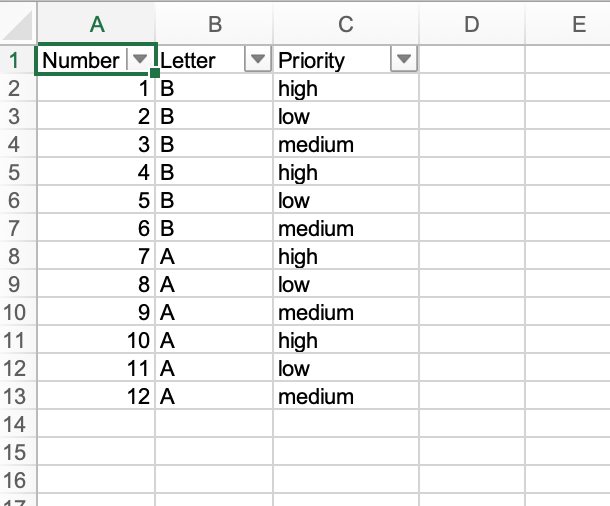
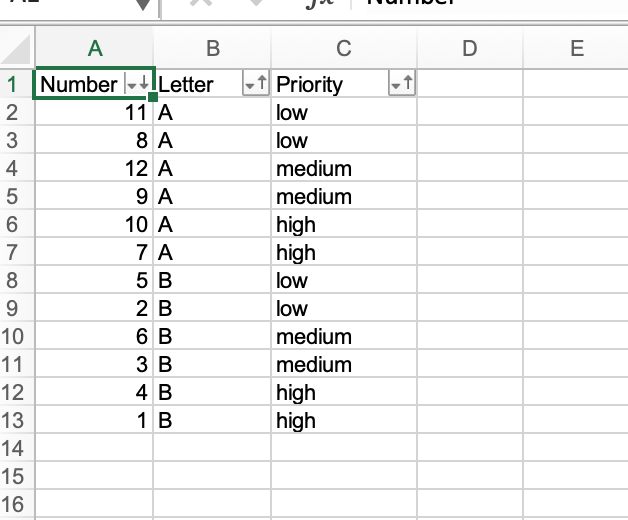

## Description

You could add sort conditions to the sort state of an auto filtered table

## Code

```ruby
require 'axlsx'

p = Axlsx::Package.new
wb = p.workbook

wb.add_worksheet(name: 'Sort State') do |sheet|
  sheet.add_row ['Number', 'Letter', 'Priority']
  sheet.add_row [1, 'B', 'high']
  sheet.add_row [2, 'B', 'low']
  sheet.add_row [3, 'B', 'medium']
  sheet.add_row [4, 'B', 'high']
  sheet.add_row [5, 'B', 'low']
  sheet.add_row [6, 'B', 'medium']
  sheet.add_row [7, 'A', 'high']
  sheet.add_row [8, 'A', 'low']
  sheet.add_row [9, 'A', 'medium']
  sheet.add_row [10, 'A', 'high']
  sheet.add_row [11, 'A', 'low']
  sheet.add_row [12, 'A', 'medium']
  sheet.auto_filter = 'A1:C13'
  sheet.auto_filter.sort_state.add_sort_condition 1
  sheet.auto_filter.sort_state.add_sort_condition 2, custom_list: ['low', 'medium', 'high']
  sheet.auto_filter.sort_state.add_sort_condition 0, order: :desc
end

p.serialize 'sort_state_example.xlsx'
```

## Output



After adding the sort conditions:


