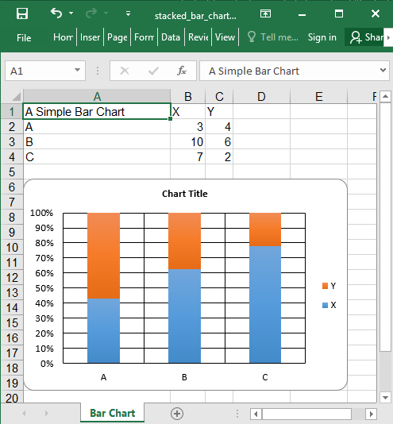

## Description

Stacked bar chart example

## Code

```ruby
require 'axlsx'

p = Axlsx::Package.new
wb = p.workbook

wb.add_worksheet(name: 'Bar Chart') do |sheet|
  sheet.add_row ['A Simple Bar Chart', 'X', 'Y']

  sheet.add_row ['A', 3, 4]
  sheet.add_row ['B', 10, 6]
  sheet.add_row ['C', 7, 2]

  sheet.add_chart(Axlsx::BarChart, start_at: 'A6', end_at: 'F20') do |chart|
    chart.add_series data: sheet['B2:B4'], labels: sheet['A2:A4'], title: sheet['B1']
    chart.add_series data: sheet['C2:C4'], labels: sheet['A2:A4'], title: sheet['C1']

    chart.bar_dir = :col
    chart.overlap = 100
    chart.grouping = :percentStacked
  end
end

p.serialize 'stacked_bar_chart_example.xlsx'
```

## Output


