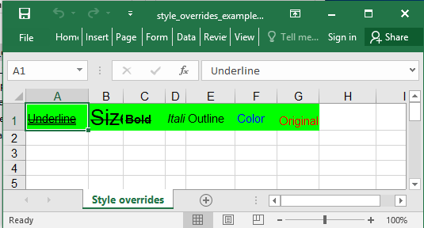

## Description

Some of the style attributes can also be set at the cell level. These cell level styles take precedence over custom styles shown in other examples. Use with caution, it could override more styles than you set (see text color in example).

## Code

```ruby
require 'axlsx'

p = Axlsx::Package.new
wb = p.workbook
s = wb.styles

default_style = s.add_style fg_color: 'FF0000', bg_color: '00FF00'

wb.add_worksheet(name: 'Style overrides') do |sheet|
  sheet.add_row ['Underline', 'Size', 'Bold', 'Italic', 'Outline', 'Color', 'Original'], style: [default_style] * 7

  sheet.rows.last.tap do |row|
    row.cells[0].u = :double
    row.cells[1].sz = 20
    row.cells[2].b = true
    row.cells[3].i = true
    row.cells[4].outline = 1
    row.cells[5].color = '0000FF' # Inline style uses this instead of fg_color
  end

  # Could be used on cell range too
  sheet['A1:C1'].each { |cell| cell.strike = true }
end

p.serialize 'style_overrides_example.xlsx'
```

## Output


