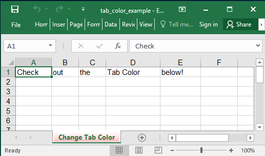

## Description

Change the color of the sheet tab.

## Code

```ruby
require 'axlsx'

p = Axlsx::Package.new
wb = p.workbook

wb.add_worksheet(name: 'Change Tab Color') do |sheet|
  sheet.add_row ['Check', 'out', 'the', 'Tab Color', 'below!']
  sheet.sheet_pr.tab_color = 'FFFF6666'
end

p.serialize 'tab_color_example.xlsx'
```

## Output


