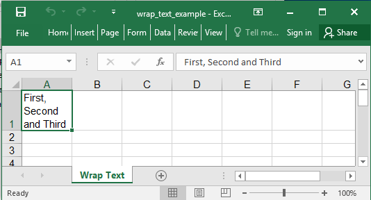

## Description

Set text wrapping from the styles

## Code

```ruby
require 'axlsx'

p = Axlsx::Package.new
wb = p.workbook
s = wb.styles

wrap_text = s.add_style alignment: { wrap_text: true }

wb.add_worksheet(name: 'Wrap Text') do |sheet|
  sheet.add_row ['First, Second and Third'], style: wrap_text
  sheet.column_widths 9
end

p.serialize 'wrap_text_example.xlsx'
```

## Output


